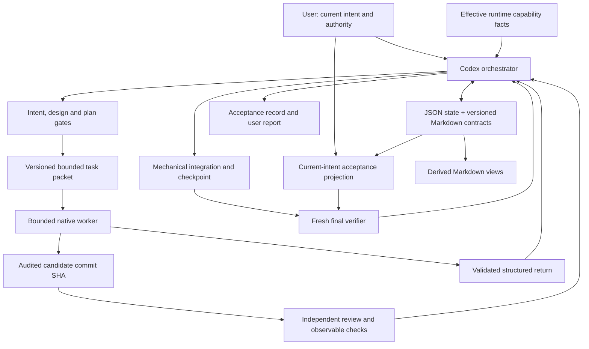

# Codex-native Autopilot V1: architecture contract

**DECISION — design baseline, 2026-09-12.** Этот пакет проектирует будущий skill. Он не запускает Autopilot и не разрешает production implementation в текущем pass.

## Назначение и источник решений

Autopilot проводит ограниченное изменение software-проекта от актуального намерения пользователя до независимо проверенного результата. Сохраняются brief, requirements, spec, gates, tickets, interfaces, waves, repair и acceptance. Codex становится orchestrator и средой bounded execution; универсальная agent platform не строится.

Приоритет: запрос пользователя и [PROJECT-BRIEF](../PROJECT-BRIEF.md) → current official Codex → Idea Scout V1 → used Autopilot → upstream → community как hypotheses. **OBSERVED:** ценность traceability, ранних contract blockers, live checks и file/git resume зафиксирована в [audit](../research/00-audit-summary.md); один T3-run не доказывает оптимальные модели, числа workers или repair limits.

Метки: **FACT** — подтверждённое свойство источника; **OBSERVED** — эмпирическое наблюдение; **INFERENCE** — вывод; **DECISION** — норма этого design; **PROPOSAL** — необязательное направление; **OPEN** — ещё не решённый вопрос. Статусы решений и эксперименты находятся в [10](10-decisions-and-experiments.md). Остальной нормативный текст под DECISION не выдаёт выбранную policy за свойство Codex.

## Система

Стрелка user→projection означает authority изменений, а не второй writer. Projection генерируется из принятых refs ledger и hash-verified canonical Markdown. Нормативные определения состояний — [01](01-lifecycle-state-machine.md); физический layout — [02](02-run-ledger-and-artifacts.md).

## Invariants

| ID | Норма | Проверяемый результат / владелец нормы |
|---|---|---|
| I1 | Один canonical run ledger и один orchestrator writer на repository | revision/fencing и recovery — 02 |
| I2 | Product truth — current authorized intent; spec и код подчинены ему | versioned amendment и G1/G2 — 01, 02 |
| I3 | Orchestrator управляет, worker реализует, reviewer проверяет | role permissions — 03 |
| I4 | Каждый product write связан с attempt и exclusive zone | lease + actual write-set — 06 |
| I5 | Dispatch/merge/acceptance опираются на версии и evidence | durable attempt / selective side-effect journal — 02 |
| I6 | Model name, handle и UI state не являются control state | routing — 04; capabilities — 07 |
| I7 | Reviewer не может незаметно изменить authoritative candidate/run state и не поставляет собственный fix | independent return и отдельный repair — 03, 05 |
| I8 | ACCEPTED требует проверки observable outcome по current intent | final packet и gate — 05, 01 |
| I9 | Неизвестная capability не считается доступной | conditional probe / safe fallback / block — 07 |
| I10 | Все существенные решения переживают потерю чата | next_action, checkpoint, immutable evidence — 02 |

## Orchestration boundary

Orchestrator владеет intent interpretation, ledger transactions, contract versions, DAG, ready work, routing, write leases, dispatch, triage, mechanical Git integration и report. Он может самостоятельно читать небольшой контекст и выполнять детерминированные проверки. Бounded exploration делегируется, когда отдельный вопрос оправдывает отдельный контекст.

Worker начинает там, где нужно менять project source/tests/assets/config в согласованной зоне. Orchestrator не вносит «маленький fix» между return и review. Содержательный merge conflict становится worker ticket. State recovery меняет orchestration metadata, code repair меняет product: это разные действия и contracts.

**DECISION:** три роли: orchestrator, worker, reviewer. Repair — режим worker; final verifier и targeted research — отдельные мандаты reviewer. Исследователь как постоянная четвёртая роль не нужен. Полные contracts — [03](03-agent-architecture.md).

## Durable и conversational

Durable: intent revisions, criteria, contracts, tickets, attempts, ownership, routes, capability evidence, reviews, issues, acceptance, recovery snapshots и next action. Conversation: рабочая гипотеза, raw exploration, рассуждения, handles, UI progress. Существенная гипотеза становится decision/issue с evidence до dispatch следующего шага.

**DECISION:** Git-required, один writer product checkout одновременно, одна active run на repository. Primary qualification target — local interactive Codex CLI на macOS; local app/IDE допускаются по capabilities, а не по surface label. Это support policy Autopilot, а не ограничение самого Codex. Точные ограничения и degraded modes — [07](07-preflight-capabilities.md).

## Что сохраняется и что заменяется

| Autopilot value | V1 механизм | Причина |
|---|---|---|
| Manifest/spec/plan traceability | Structured state + canonical Markdown refs/hashes | Один статус требования вместо нескольких вручную синхронизируемых файлов |
| Fresh executor per ticket | Native bounded child; worker freshness и blind verification имеют разные eligibility standards | Убирает Claude→Codex bridge; сохраняет границу контекста |
| Interfaces and wave discipline | Versioned contracts, DAG и serial write waves | Сохраняет seams, serial V1; bounded per-ticket worktrees проверяются после V1 в E10 |
| Independent review + blind final | Disposable reviewer mandates + current-intent projection | Независимость не зависит от сохранности процесса |
| State/dashboard | JSON snapshot + derived status/report + optional local read-only ledger projection | State остаётся canonical; dashboard читает текущий ledger и не добавляет mutable state |
| Handoff and recovery | Selective effect journal + attempts + Git fingerprints | Handles заменимы; interruption не означает повтор побочного действия |

Удаляются: обязательный Claude, обязательный process bridge, обязательная custom TOML library, persistent reviewer handles, T0–T3 ticket quotas, «50 tool calls», универсальные repair ceilings, mandatory dashboard/backend, mandatory polish, автоматическая запись в AGENTS/CLAUDE, nested swarms, обязательная Astra/external review. Один optional custom read-only reviewer file или bounded Codex reviewer process допускается лишь после E03; transport здесь не выбран. Пофайловое покрытие старых 21 файлов — [08](08-skill-file-architecture.md). Optional local read-only dashboard возвращён отдельным runtime projection поверх current ledger.

## Instruction architecture

**DECISION:** writing-for-agents применяется к hierarchy, а не как перенос runtime syntax. Always-loaded metadata короткая; при invocation читаются только entry и текущая фаза. Branch-specific safety, failure и routing details раскрываются при соответствующем действии. Данные среды принадлежат capability facts, не тексту skill.

Co-location: определение поля и его validation живут вместе; schema — единственное место structural types. Разделение по фазам управляет чтением, но само по себе не очищает уже загруженный контекст. Context eligibility определяется по роли в 03; после compaction/resume выполняется re-grounding из 08.

## Карта нормативных владельцев

| Вопрос | Единственный полный контракт |
|---|---|
| Состояния, transitions, gates | 01-lifecycle-state-machine.md |
| Data model, atomicity, artifact authority | 02-run-ledger-and-artifacts.md |
| Roles and lifetimes | 03-agent-architecture.md |
| Routing, retries and escalation | 04-routing-and-escalation.md |
| Worker/reviewer/final packets and returns | 05-task-and-return-contracts.md |
| Filesystem/Git/rollback | 06-safety-write-git-model.md |
| Capabilities and supported surfaces | 07-preflight-capabilities.md |
| Future skill files and information budgets | 08-skill-file-architecture.md |
| Release acceptance and scope coverage | 09-v1-functional-spec.md |
| Decision dispositions and bounded experiments | 10-decisions-and-experiments.md |
| Independent review adjudication / revision rationale | 11-review-adjudication.md |

Другие документы ссылаются на владельца; краткая сводка не вводит альтернативную норму.
